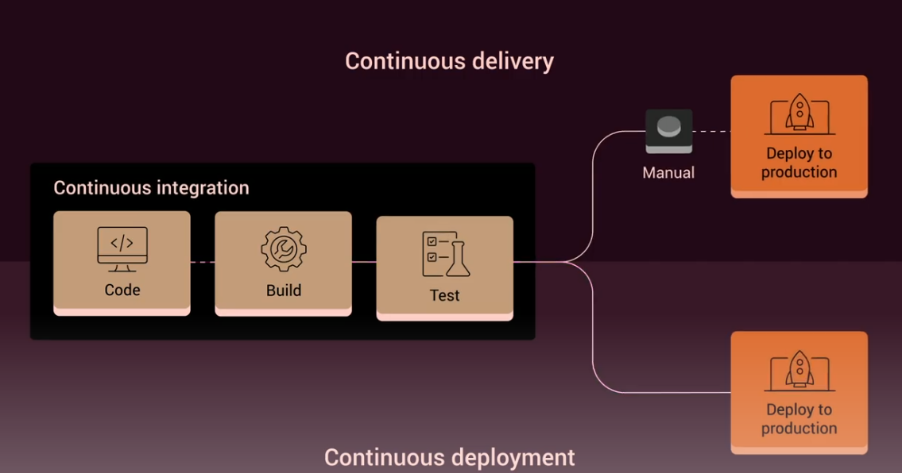

# Automated Software Testing with Playwright:


## Section 1+2: Fundamentals:
- Go ahead and set up a nodeJS project to start.
- Playwright installation is **non-standard**:
   a) First install with *"npm i @playwright/test"*
   b) We need to run the playwright files with node to download browser extensions: *"npx playwright install"*
- Tests in playwright are written in TypeScript by default.
- Everything in Playwright is Asychronous - so we have to use async/await syntax. *Specifically, when we do function calls that manipulate our browser test models, each is async*

- Running a Basic Test:
 1) Create a Test folder, and a test file (see example).
 2) Run *"npx playwright test"* to run your battery of tests.

 - Definition:A headed test is one that is run in a browser instance, instead of behind-the scenes. use the *--headed* flag for npx playwright test above.

- Basic Options:
  1) --headed: launch a browser to perform tests.
  2) --browser=<firefox,chromium,...all>: Select one or more browsers to perform the test.
  3) Specific test files: *By default*, PW will run everything in the /test folder. You can specify a path to one file.

- Playwright uses awaits for a series of user events to occur, to test different conditions. For example, suppose we want to see a user fail to login, across two different pages. For a Test, we would write:

```
  test("Clicking on ELements @MyTag2", async ({ page }) => {
   await page.goto("http://zero.webapp.com")
   await page.click("#signin_button")
   await page.click("text=Sign In")
   const errorMessage = await page.locator(".alert-error");
   await expect(errorMessage).toContainText("Login ERROR")
  })
```

### Quick Review of CSS/JQuery Selectors:

Playwright can search a page's DOM tree for almost any property of any element. Some common selectors:

- By ID: "#myelement"
- by Class: ".myclass"
- By Tag: "button"
- Select Visible Elements: ".test-class:visible"
- Combinations: "#username .some-class"

- load a page: *page.goto()*

- perform a test, involving an element: *expect(elemRef).toTest()...*

- Performing inputs: 
  - use the *page.type()* or
  - *page.click()* functions.


- Testing Annotations: We can do modification to test blocks using Annotations
  - Skipping a test: *test.skip*(...)
  - Only run one test: *test.only*(...)
  - Making a suite of tests/grouping:

  ```
  test.describe("Descriptive Name", () => {
    test(...)
    test(...)
    test(...)
    })
  ```

The basic imperative pattern for a battery of tests, is to **wrap a series of tests in a test.describe() functional call.**

- **Test Tagging** is another way to select specific tests in a file.
The description string of the test() is given a special AT tag, which our cmd line runner will search for. 
- Example: *"test('My test @TestGroup1 @TestGroup2')"*. To run these tagged tests specifically: 

```
  npx playwright test --grep @TestGroupX
```
- You can also compliment the set of tagged tests by using the *--grep-invert* modified option!

### Playwright Configuration Files:

- For different browsers, and test environments, we use configuration files to avoid passing endless parameters. You can set global parameters, as well as browser specific parameters. See *playwright.config.ts* for details.

- To use configurations and projects: *"npx playwright test --config=<filepath> --project=<projectName>"*


- Reporters: Display the results of our tests. These can be verbose, visual or export to different files or screens.
    - Line/Dot: Simple coloured visuals indicating tests passed on Command Line.
    - List: List every test status on Command Line (defualt)
    - junit: use XML output.
    - html: write all data to an html file, writes to the /data folder.


- We can take Screenshots of our testing application, either the full page or individual elements.

-Hooks: Are used to add code before and after tests - and can help with setup/takedown, reducing code redundancy.
- Methods are:
  - beforeEach() 
  - beforeAll()
  - afterEach()
  - afterAll()

- Custom Functions: Simply put your own functions in a file with marked exports, and import with the ES Module system. 
- Remember to mark function calls with **"await" as everything is async**.

- Node Scripts: We don't want to type long command option strings into terminal, so setup package.json with the following:

```
"scripts": {
  "tests:chrome": "playwright test --config=playwright.config.ts --project=Chromium",
  "tests:firefox": "playwright test --config=playwright.config.ts --project=Firefox"
},
```

Scripts themselves are of course run with the npm command, such as:

```
npm run tests:chrome
```

This is the preferred way to run tests, instead of typing long strings with *npx playwright...*


-Playwright Inspector: Is similar to a FF/Chrome Debugger console. We can place breakpoints by using the *page.pause()* function. Note: This only works if the test is **--headed**


- Artifacts on Fail: We can produce videos and screenshots when one of our test cases fails. In the playwrite.config file, use the following option for the **use** subobject: *screenshot: "only-on-failure"*

- Running Tests in Parallel: Tests are run sequentially, unless we specify the .*parallel()* option. For a given test describe() block, we can modify it with *test.describe.parallel()...* To thread all of our subtests. If they are independent, this makes things faster.

## Section 3: End-To-End Test Project, using PW Fundamentals:

This was an example project, that implements the functionality mentioned above. See code base for details.

## Section 4: Page Objects Model:

The Page objects model is a Testing Design Pattern. Instead of having sprawling scripts of tests, grouped together with .describe() statements, we make Object classes *for each of the major application pages we wish to test*.

### Parts of a Playwright Project (by folders):

- /node_modules: where our playwright library files live.

- /package.json: Where we define our npm run X scripts, to run batteries of test.

- /e2e-config.ts: Our main playwright configuration file.

- /test/*: Where all of our test files live. This is where Playwright will look for tests first.


### Creating our Project Folder:

- When we specify Page Classes, each word is Capitalized by convention (ex :LoginPage.ts).
- Class Files are stored at the root level of the directory.
- Each Test Script imports a Class File, and in our describe() containers, we set local variables that hold an instance object of each class

```
import { ClassName } from "../ClassName"

test.describe...() {
  let className = ClassName

}

```

### Simple Example of Object Class and Test Container in Action:

Consider the HomePage Class:

```
import { Locator, Page } from '@playwright/test'
export class HomePage {
    readonly page: Page 
    readonly signInButton: Locator
    readonly searchBox: Locator

    constructor(page: Page) {
        this.page = page
        this.signInButton = page.locator('#signin_button')
        this.searchBox = page.locator("#searchTerm")
    }

    async visit() { ... }
    async clickOnFeedBackLink() { ... }
    async clickOnSignIn() { ... }

    async searchFor(phrase:string) {
        await this.searchBox.type(phrase)
        await this.page.keyboard.press("Enter")
    }
}

```

And how this is used in the *search.spec.ts* test bundle:

```
import { test, expect } from "@playwright/test"
import { HomePage } from "../HomePage"

test.describe("Search Results", () => {
    test("Should find test results", async ({page}) => {
       let homePage: HomePage = new HomePage(page)

        await homePage.visit()
        await homePage.searchFor("bank")

        const numOfLinks = await page.locator("li > a")
        await expect(numOfLinks).toHaveCount(2)
    })
})

```

The large, sprawling expanses of imperative code have been eliminated (as seen in E2E), because all this funcitonality is placed in the HomePage class! We have cleaner code.

### Abstract Classes:

We can model every page we visit with a Page Object Class. But for pages that have overlapping properties and methods, we can derive an Abstract Class to further reduce code-redundency.

Consider an AbstractPage that adds a wait() method to all pages that inherit it:

```
import { Page } from "@playwright/test"

export class AbstractPage {
    readonly page: Page

    constructor(page: Page) {
        this.page = page
    }

    async wait(time) {
        await this.page.waitForTimeout(time)
    }
}

```

Inheritence in Type Script is done as follows:

```
export class LoginPage extends AbstractPage {
...
}

```

## Section 5: Advanced Visual Testing:

Sometimes, we want to take screenshots of our tests, and compare them against reference screenshots to see if anything on screen has changed (due to development mishaps for new code). 

Playwright can be configured to take screenshots of running page instances, during test interaction.

### Basic Setup:

In the config file, add the line: **"testDir: "./visual"**. To get a test to take a screenshot, use the **page.screenshot()** function.

Note: For the first test run, the screenshot will be generated and placed in your specified directory. This is your reference image.


### Update Screenshots:

Instead of deleting old ones, you can use the --update-snapshots flag to generate new ones:

```
playwright test --config=visual.config.ts --project=chromium --update-snapshots
```


## Section 6: Advanced: REST API Testing:

In this section, we set-up a Playwright project that queries online APIs. Frequently, applications will use APIs to fetch/post data from other web services - and testing these calls is a common development test-case.

For this project, we will use [reqres.in](https://reqres.in). Which is a free service that allows for API calls across HTTPS.

This section goes through basic testing patterns to call APIs with GET/POST/PUT/DELETE requests. See /api folder for code details (it is quite straightforward).

## Section 7: Advanced CI/CD Integration:

This section covers Jenkins Server - a Java based tool stack (by the makers of Apache Tomcat), that deals with Continuous Integration and Continuous Deployment.

As Java is not my main focus, and I will only be developing in small teams or on my own - this section isn't of use to me. Indeed, the only way to learn it is to do it, and I have no project or large team in order to do it...so a simple summary of CI/CD is provided below.



To start a new jenkins-server instance with npm run, we can use node scripts in package.json:

```
  "jenkins-server": "java -jar jenkins.war -httpPort=8081 --enable-future=java"
```

### Section 8: Advanced: Tips & Tricks:

See the ./tips/tips.spec.ts folder for details. This section outlines the following features that one might find useful.

- Exposing the TestObject: This is an optional parameter for your anonymous testing function. You can dump the state of Playwright with it.

- "Skip a Browser" Annotation: Can avoid a specific browser when running tests. Uses the .skip() function we are used to.

- "Fix-Me" Annotation: Similar functionality to .skip(), used for a different catagory of problems (code revisions and code stability (?))

- "Kick-Me" Annotation: (just kidding).

- Retries Feature: Command line arg that will retry tests that fail (example: network issues)

- Parameterized Tests: Run tests on arrays of data (example: list of logins, try all of them.)

- Simulate Mouse Movement: You can control the mouse in the simulated browser. It does not move the mouse on your screen (just a DOM representation).

- Open Multiple Tabs per window.

- Device Emulation: A particularly useful feature - you can choose any tablet/phone device, and render a webpage using its screen constraints. A command-line option.

- Generate PDF files.

- Generate Custom Screenshots

- Configure Timezones for Browser Simulatoins.

- Data Helpers: Used for randomized or parameterized tests.

### Section 9: Professional Custom Reporting:

In this section, we learn how to further customize our test reporting, when playwright runs through a battery of tests. 

To do this, we define a special file called reporter.ts at the root directory of the project. The Abstract Class *Reporter*  is imported into the file:

```
import { Reporter } from "@playwright/test/reporter"
```

We then implement the class's predefined methods, which allow us to customize report outputs. Data Inspection/Template messages can naturally be done at the beginning and end of a battery of tests, or for every test. 

The basic functions that need implemented are onBegin, onEnd, onTestBegin, onTestEnd.

See reporter.ts for code details.

### Section 10: BDD with Cucumber and Playwright:

BDD (Behaviour Driven Development) is a testing methedology where the customer (or consumer) writes tests for a piece of software being developed. This is apart of Agile Development practices. Generally, these tests are black-box in the sense that the customer has no understanding of how code works (and will not implicitly create easy or biased tests to protect Programmer Egos). 


Some Spurous Notes on Cucumber - See Project folder for technical details::
- **chai @cucumber/cucumber chai cucumber-html-reporter ** packages were installed via NPM.
- For this project, we can't just keep everything in a folder and install node_modules at the root level (easily).
- There are a number of components to get Cucumber working (it is not all built in)
  - Setup folder: contains assertions.js (for an assertion library import), and a hooks.js file 
  - Step Definitions Folder: For a BDD script, each user wish is a "step definition". These
  templated phrases are called (like functions), and a set of actions in a functional
  block is executed, somewhere.
 - Features Folder: A feature is where our Behavioural Tests (or user wishes) are stored. They compriese of sets of english statements, that are interpreted.
  - Reports Folder: Here, our test run reports are printed and stored. 
  - Cucumber.js: This file binds all of the pieces together, and gets node to run the framework.
  - Reporter.js: Configure your reporter here.
- Cucumber seems to rely on the older CommonJS import system - probably for greater compatability.
- Overall, this framework creates an easy way for users to generate BDD tests. The framework on the developer/tester side quite fragmented, however :(.


### Section 11: BDD with CodeCeptJS and Playwright:

- Packages required: **playwright and codeceptjs**
- CodeceptJS has a nice initialization script that sets everything up for us. Call it with **npx codeceptjs init **.
- To run a test: **npx codeceptjs run**
- A single test is called a "Scenario". The global object to access user wishes is just "I". An example of a beharvioural test is below:

```
Scenario('test something',  ({ I }) => {
    I.amOnPage("https://www.example.com");
    //This must search the entire DOM tree
    I.see("Example");
    I.dontSee("Google");
    I.seeElement("h1")
    I.dontSeeElement("#nonexistant")
});
```

- For a PageObjects model, our framework also has commands to auto-generate a template. Use: ** npx codeceptjx gpo ** (gpo = generate page object)
  - Note that you should check the conf.js file to make sure the GPO path was added to to the config file (My CodeceptJS added it, but the instructor's version did not.)
- After seeing two BDD;s, I would personally choose CodeceptJS over Cucumber. Much faster to develop with.
  - However it reqiures users to have basic coding skills (v.s written English tests for Cucumber).

### Section 12: Web Scraping with Playwright:

This is another area where Playwright shines. In the past, I had experiences with web scraping using tweepy and python reddit scraping libraries. Web Scraping on web 2.0 websites (especially with logins and accounts) could be a painful affair, involving Selenium and other frameworks.

With Playwright's abilities to interact with pages for testing, it can naturally be used to scrape data off complex websites. The only extra step is the storage of the data.

Of particular note, a randomized user library must be used, to evade anti-scraping technologies. Install the **random-useragent** library for this - it does not come bundled with Playwright.

For a webscraping project, we do not require the **@playwright/test** suite. Use **playwright** instead. Curiously, this is a CommonJS library, that is imported with require().

See project folder for the code layout.

### Section 13: Integration with Percy:

The course instructor still has this as a work in progress (!!). Doesn't look like it will be finished anytime soon (no recent instructor involvement).

Skipped.

### Section 14: Third Party Test Runners:

This section provides short tutorials on integration with Jest, Mocha and Ava is presented.

- Playwright can be used for [integration and unit testing](https://pkerschbaum.com/blog/using-playwright-to-run-unit-tests), not just E2E testing. So it can stand alone without these frameworks.
- These frameworks are older than Playwright (more boilerplate, older libraries).
- Ava is too obscure to learn.

### Section 15: HTML+Javascript review:

This provided a basic introduction to HTML and JavaScript. No need to make notes on this.

### References:

1) [CI/CD Definition](https://www.youtube.com/watch?v=wbnOmXWyd9E)

2) [Playwright with unit tests](https://pkerschbaum.com/blog/using-playwright-to-run-unit-tests)